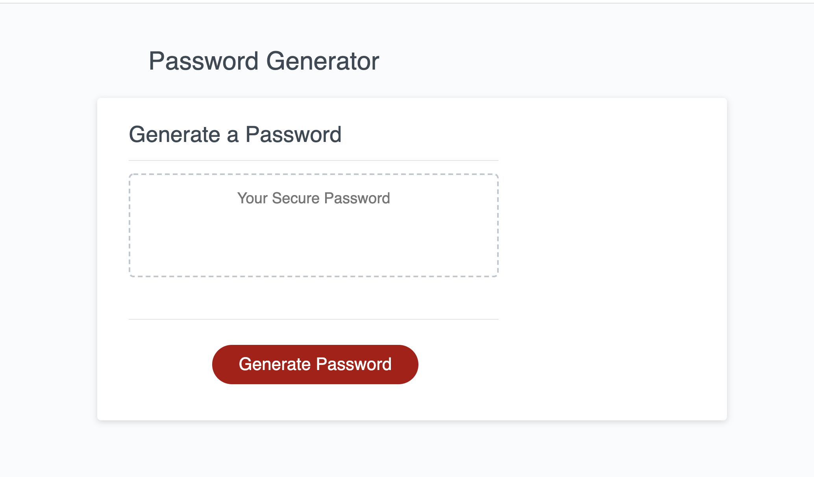
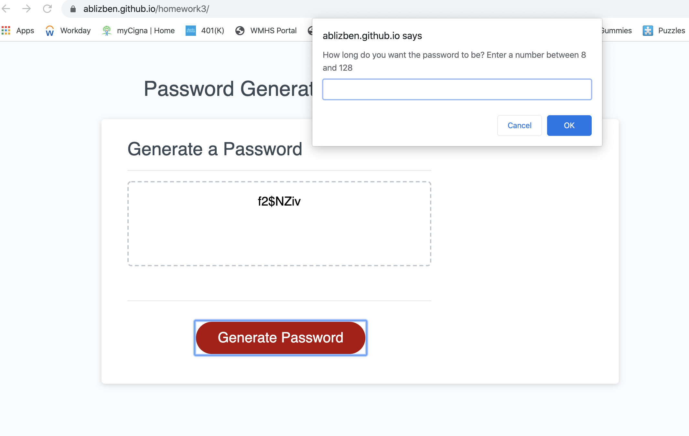

<h2>Unit 03 Javascript Homework: Password Generator</h2>
The purpose of this homework was to create an application that will generate a random password based on user-selected criteria. 

<h3>Code Style</h3>
<ul>
  <li>HTML</li>
  <li>CSS</li>
  <li>JavaScript</>
</ul>

<h3>Prerequisites</h3>
<ul>
  <li>Visual Studio Code</li>
  <li>GitHub Account</li>
</ul>

<h3>Password Generator Criteria</h3>
<ul>
  <li>Upon clicking the button, the user is presented with a series of prompts for password criteria</li>
  <li>Length of passwords should be at least 8 characters and no more than 128 characters</li>
  <li>The user should be able to choose lowercase, uppercase, numeric, and/or special characters for their password</li>
  <li>When the password is generated, it should be displayed in an alert or written to the page</li>
</ul>

<h3>How to Push to GitHub</h3>
<h4>If you have not commited a repository:</h4>
<ul>
  <li>Create a new respository in GitHub</li>
  <li>Give the repository a name, set it to public, and check add a README</li>
  <li>Copy the link associated with your new repository (use SSH)</li>
  <li>Open Terminal (or Bash if using Windows) window</li>
  <li>Go into folder where you want to download your code</li>
  <li>Type in "git clone (your link)"</li>
  <li>Create html file</li>
  <li>Go to file in Terminal</li>
  <li>Enter "git add -A"</li>
  <li>Enter "git commit -m "Added a new file"</li>
  <li>Enter "git push origin master"</li>
</ul>
<h4>If you have commited a repository already:</h4>
<ul>
  <li>Go to file in Terminal</li>
  <li>Enter "git add -A"</li>
  <li>Enter "git commit -m "Added a new file"</li>
  <li>Enter "git push origin master"</li>
</ul>

<h3>Built With</h3>
<ul>
    <li>Twitter Bootstrap 4</li>
</ul>

<h3>License: MIT</h3>

<h3><a href="https://ablizben.github.io/homework3/">Link to App</a></h3>

